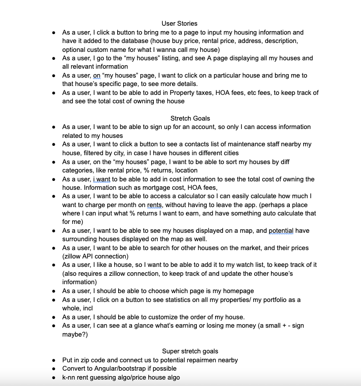
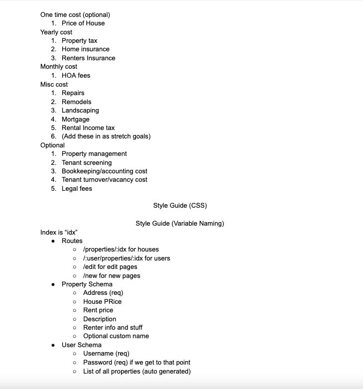
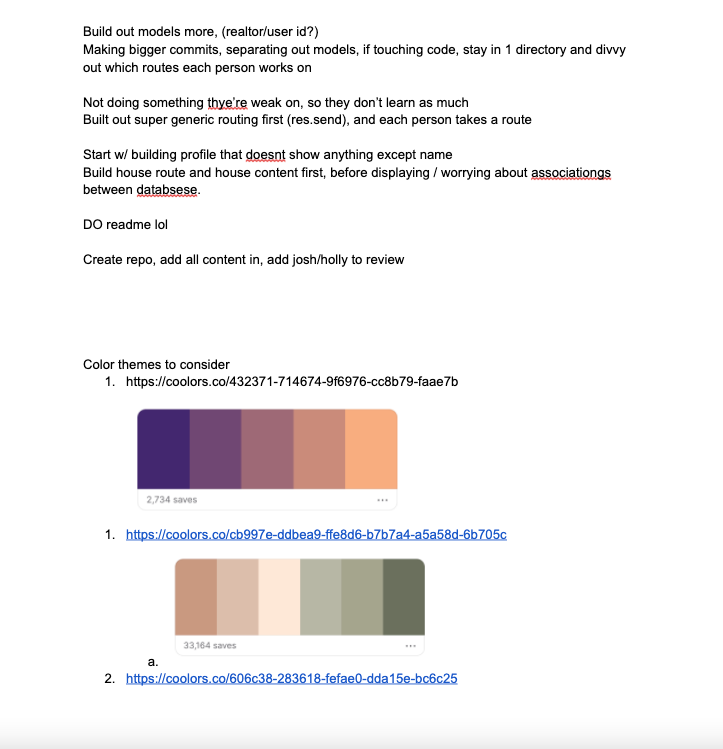
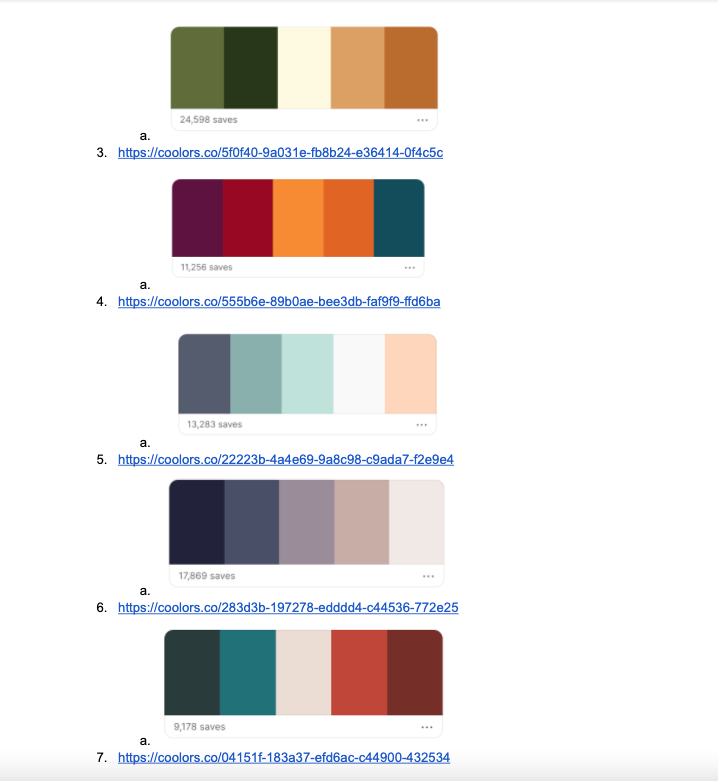

# Project #1 : Property Portfolio Manager(by Team AIDs)

# Index : 
- [Usage](#Usage)
- [Description](#Description)
- [Functional Description]([#Functional])
- [Technologies](#Technologies)
- [Wireframes](#Wireframes)
- [Authors](#Authors)

## Usage
- User click a button to bring user to a page to input user's housing information and have it added to the database.(Rental price, Address etc)
- User go to the "My houses" listing, and see a page displaying all user's houses and all relevant information.
- User is able to manage their all tenant's information in "My houses" page

## Description
- This is an app that allows property owners to organize and manage their properties & tenants' information

## Functional Description
1. Sign up & Sign in
    As a user, I input my information to the page to sign up or log in to the app.
2. Update
 As a user, I click a button on the properpage to update my own properties' and tenants' information.
3. Delete
 As a user, I clikc a button to delete my property or tenant.
4. Add
 As a user, I click a button to go to a page to add a property or tenant to a specific property.
5. Map API
 As a user, I want to see my properties on a map, so I click a button to bring me to that page.

## Technologies
- HTML, JS, Node.js, Express, Bootstrap, MongoDB, Mongoose, bCrypt

## Wireframes

## Authors
#### Created by
- github.com/alan-deng (Alan Deng)
- github.com/isabellukk (Isabel Luk)
- github.com/style6513 (DaeYoung Hwang)